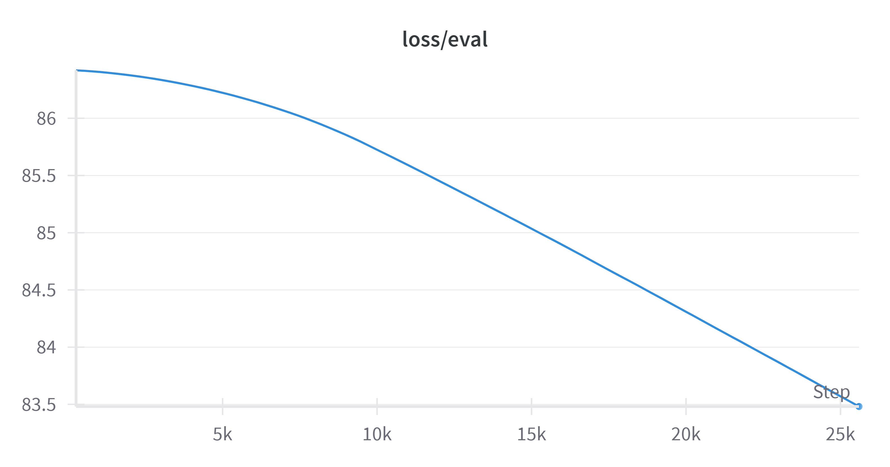
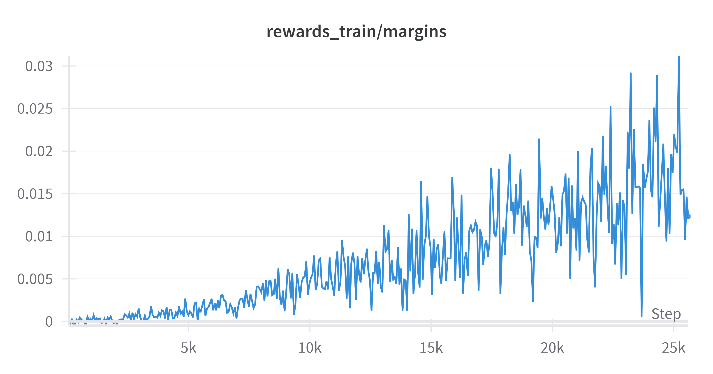
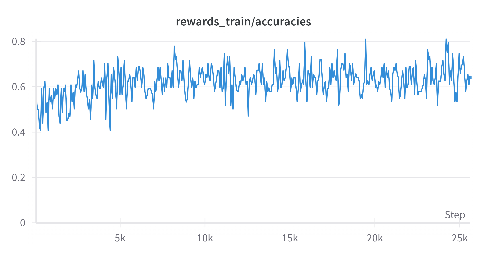

# <center> DPO_Quant

Learning from human preferences is a paradigm adopted in the natural language processing literature to better align LLM to human desiderata. Recently RLHF has been used successfully in many senses to get a better performance. In 2023 NeurIPS, [DPO](https://arxiv.org/abs/2305.18290)  was proposed for addressing the problem of huge resource consumption in training. However, for people who don't have enough GPUs, training a model with DPO is still a difficult situation. In this reposity, I implemented a code reproduction of the DPO algorithm and the [BitsandBytes](https://github.com/TimDettmers/bitsandbytes) is used for the model quantization to make run of DPO on a 24G 4090 possible.


## 👋Getting Started

- System requirement: Ubuntu20.04/Windows 11, Cuda 12.1
- Tested GPUs: RTX4090

### Create conda environment:

```
 conda create -n dpo python=3.10
 conda activate dpo
```

### Install packages with `pip`

```
 pip install -r requirements.txt
```

### Switch Source

For some reason, user may not be able to access HuggingFace conveniently. Run the code bellow to handle this.

```
export HF_ENDPOINT="https://hf-mirror.com"
```


## 📈Training

Model pythia2.8B and dataset Anthropic/hh-rlhf is used in the training. For customized training, you need change  `dataset_name` and `model_name` in the file config.yaml.

Run the code bellow to start a training.

```
python Train.py
```


## 🤔Experiment Analysis

I conducted the experiment with BitsandBytes to load the quantization model. The main pipline of DPO is (1)Training the model using SFT on a preference dataset and (2)Traing the model using DPO on the same dataset.

In SFT, the run lasts 2h20min, we can see from the figure that the eval_loss snowly decreases when the step grows.



For more details, check [here](https://wandb.ai/qiyuwu/pythia2_8B_DPO_Quant/runs/co6guc8k?nw=nwuserwqy123202108) 

In DPO, the run lasts 7h30min, we can see from the figure that the accuracies and margins snowly increases when the step grows.




For more details, check [here](https://wandb.ai/qiyuwu/pythia2_8B_DPO_Quant/runs/0tejjuhj?nw=nwuserwqy123202108) 

Compared to the example in [eric-mitchell/direct-preference-optimization: Reference implementation for DPO (Direct Preference Optimization) (github.com)](https://github.com/eric-mitchell/direct-preference-optimization), our experiment is more unstable in training, but achieved pretty good results in accuracy. Besides, due to time constraints, our experiments were only trained on top of about 25K conversations, which is why our experiments did not achieve significantly good results on top of some other metrics.

## 📄Reference

The work is based on a lot of previous work and blogs, as well as some HuggingFace courses and documentation. Many thanks to authors for sharing this, it has helped me gain a lot. Listed below are the references I used to learn.

- [eric-mitchell/direct-preference-optimization: Reference implementation for DPO (Direct Preference Optimization) (github.com)](https://github.com/eric-mitchell/direct-preference-optimization)
- [FSDP-QLoRA (huggingface.co)](https://huggingface.co/docs/bitsandbytes/main/en/fsdp_qlora)
- [Behind the pipeline - Hugging Face NLP Course](https://huggingface.co/learn/nlp-course/en/chapter2/2)
- [QLoRA 量化实现：BitsandBytes 代码研究 - 知乎 (zhihu.com)](https://zhuanlan.zhihu.com/p/646235855)
- [Answer.AI - You can now train a 70b language model at home](https://www.answer.ai/posts/2024-03-06-fsdp-qlora.html)
